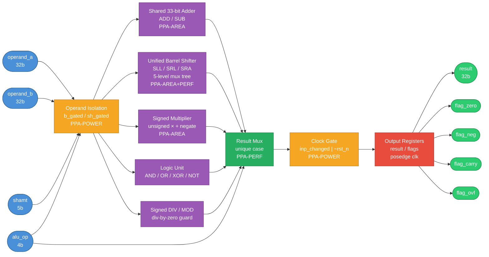
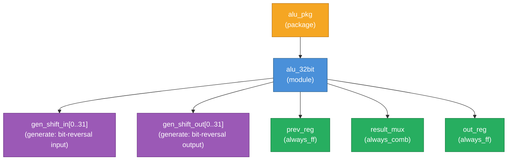

# ALU 32-bit Module Specification

**Document ID:** ALU32-SPEC-001  
**Version:** 1.1  
**Source RTL:** `alu_32bit_fixed.sv`  
**Package:** `alu_pkg`  
**Status:** Bug-fix revision — 3 RTL defects corrected (see Appendix A)  
**Previous version:** 1.0 (based on `alu_32bit_buggy.sv`)

---

## 1. Introduction

### 1.1 Overview

`alu_32bit` is a fully synchronous, PPA-optimised 32-bit Arithmetic Logic Unit designed for integration into a CPU datapath. It supports 12 operations covering arithmetic, logical, shift, multiply, and division functions. All outputs are registered on the rising edge of `clk` and the module uses an active-low synchronous reset (`rst_n`).

The module is structured around four major PPA (Power–Performance–Area) optimisation pillars:

| Pillar | Technique |
|---|---|
| **Power** | Operand isolation gating + integrated clock gate (ICG) |
| **Area** | Shared 33-bit adder for ADD/SUB; unified barrel shifter for all shifts |
| **Area** | Signed multiply implemented using unsigned multiplier + sign restore |
| **Performance** | `unique case` result mux for parallel, priority-free decode |

The package `alu_pkg` is defined at the top of `alu_32bit.sv` and contains the `alu_op_t` enum with all 12 operation encodings. Any module that instantiates `alu_32bit` or needs to drive `alu_op` must import `alu_pkg::*`.

### 1.2 Scope

This specification covers the RTL behaviour of `alu_32bit` as implemented. It does not cover physical implementation, synthesis constraints, or verification methodology.

### 1.3 Definitions

| Term | Definition |
|---|---|
| `alu_op_t` | 4-bit enum type defined in `alu_pkg` |
| `clk_en` | Internal combinational clock-gate enable; asserted when inputs change |
| `is_arith` | Internal flag: high when `alu_op` is `ALU_ADD` or `ALU_SUB` |
| `is_shift` | Internal flag: high when `alu_op` is `ALU_SLL`, `ALU_SRL`, or `ALU_SRA` |
| ICG | Integrated Clock Gate — a standard-cell latch-based clock gate inferred by synthesis |
| PPA | Power–Performance–Area |

---

## 2. Feature Summary

### 2.1 Requirements

| REQ_ID | Title | Type | Acceptance Criteria |
|---|---|---|---|
| REQ_001 | 12 ALU operations | Functional | All 12 `alu_op_t` encodings produce correct combinational results |
| REQ_002 | 32-bit data path | Functional | All operands and result are 32 bits wide |
| REQ_003 | Registered outputs | Functional | `result` and all flags change only on `posedge clk` |
| REQ_004 | Active-low synchronous reset | Functional | `!rst_n` on `posedge clk` resets all outputs to zero |
| REQ_005 | Zero flag | Functional | `flag_zero == (result == 32'b0)` every cycle after reset |
| REQ_006 | Negative flag | Functional | `flag_neg == result[31]` every cycle after reset |
| REQ_007 | Carry flag (ADD/SUB only) | Functional | `flag_carry` reflects adder carry-out; forced 0 for all other ops |
| REQ_008 | Overflow flag (ADD/SUB only) | Functional | `flag_ovf` reflects signed overflow; forced 0 for all other ops |
| REQ_009 | Divide-by-zero safety | Functional | `result == 0` when `alu_op ∈ {ALU_DIV, ALU_MOD}` and `b_gated == 0` ✅ Fixed v1.1 (was `operand_b`) |
| REQ_010 | Operand isolation | Power | `b_gated` and `sh_gated` suppress toggle when operand unused |
| REQ_011 | Clock gate enable | Power | Output registers hold value when inputs are unchanged between cycles |
| REQ_012 | Shared adder | Area | Single 33-bit adder handles both ADD and SUB |
| REQ_013 | Unified barrel shifter | Area/Perf | Single 5-level mux tree handles SLL, SRL, SRA |
| REQ_014 | Signed multiply | Area | 32-bit signed product using unsigned multiplier + sign correction |
| REQ_015 | Signed DIV/MOD | Functional | Division and modulo operate on signed 32-bit operands |

### 2.2 Ambiguity Log

| Q_ID | Question | Impact | Resolution (from RTL) |
|---|---|---|---|
| Q_001 | Is reset synchronous or asynchronous? | Sensitivity list of all `always_ff` | **Synchronous** — `always_ff @(posedge clk)` only |
| Q_002 | Does the clock gate prevent output register update on first cycle after de-reset? | Power savings vs. output latency | `clk_en = inp_changed \| ~rst_n` — always enabled during reset, first active cycle guaranteed |
| Q_003 | Which bits of MUL result are captured? | Truncation vs. full product | Lower 32 bits only (`prod_u[31:0]`) |
| Q_004 | Is SLL/SRL/SRA shamt sourced from `shamt` port or `operand_b`? | Interface | Dedicated `shamt [4:0]` port |

---

## 3. Functional Description

### 3.1 Hardware Architecture

The diagram below shows the complete dataflow from input ports through each PPA datapath block to the registered output stage.



**Purpose:** All input operands first pass through the operand isolation stage which zeros unused operands, eliminating unnecessary switching activity. The gated operands feed five parallel datapaths (adder, shifter, multiplier, logic unit, DIV/MOD). The `unique case` result mux selects the active datapath output each cycle. The clock gate then controls whether the output registers actually capture a new value — they hold their state when inputs are stable.

---

### 3.2 RTL Hierarchy



**Purpose:** `alu_pkg` is compiled separately and imported before the module declaration. The two `generate` blocks synthesise to 32 instances each of a 2:1 mux (bit-reversal). The three named `always` blocks have distinct roles: `prev_reg` tracks previous inputs for the clock gate, `result_mux` is the purely combinational datapath, and `out_reg` is the registered output stage.

---

### 3.3 Operation Table

| Mnemonic | Encoding | Operation | Result | Flags Updated |
|---|---|---|---|---|
| `ALU_ADD` | `4'd0` | `operand_a + operand_b` | 32-bit sum | Z, N, C, V |
| `ALU_SUB` | `4'd1` | `operand_a - operand_b` | 32-bit difference | Z, N, C, V |
| `ALU_AND` | `4'd2` | `operand_a & operand_b` | Bitwise AND | Z, N |
| `ALU_OR`  | `4'd3` | `operand_a \| operand_b` | Bitwise OR | Z, N |
| `ALU_XOR` | `4'd4` | `operand_a ^ operand_b` | Bitwise XOR | Z, N |
| `ALU_NOT` | `4'd5` | `~operand_a` | Bitwise NOT of A | Z, N |
| `ALU_SLL` | `4'd6` | `operand_a << shamt` | Logical left shift | Z, N |
| `ALU_SRL` | `4'd7` | `operand_a >> shamt` | Logical right shift (zero fill) | Z, N |
| `ALU_SRA` | `4'd8` | `operand_a >>> shamt` | Arithmetic right shift (sign fill) | Z, N |
| `ALU_MUL` | `4'd9` | `operand_a × operand_b [31:0]` | Lower 32 bits of signed product | Z, N |
| `ALU_DIV` | `4'd10` | `$signed(A) / $signed(B)` | Signed quotient; 0 if B==0 | Z, N |
| `ALU_MOD` | `4'd11` | `$signed(A) % $signed(B)` | Signed remainder; 0 if B==0 | Z, N |

> **Flag key:** Z = `flag_zero`, N = `flag_neg`, C = `flag_carry`, V = `flag_ovf`.  
> C and V are **forced to 0** for all operations except ALU_ADD and ALU_SUB.  
> **BUG FIX 1 (v1.1):** `flag_ovf` previously used `comb_carry` (unsigned carry-out) instead of `ovf_flag` (signed overflow detector). Fixed: `flag_ovf <= is_arith ? ovf_flag : 1'b0;`

---

### 3.4 PPA Datapath Details

#### 3.4.1 Operand Isolation (PPA-POWER)

Three decode signals gate the operands before any computation:

```
is_shift = (alu_op == ALU_SLL) | (alu_op == ALU_SRL) | (alu_op == ALU_SRA)
is_arith = (alu_op == ALU_ADD) | (alu_op == ALU_SUB)
needs_b  = ~(alu_op == ALU_NOT) & ~is_shift

b_gated  = needs_b  ? operand_b : 32'b0
sh_gated = is_shift ? shamt     : 5'b0
```

`ALU_NOT` only consumes `operand_a`; shift operations use `shamt` not `operand_b`. All downstream logic is driven by `b_gated` and `sh_gated`, so the physical wires toggle only when the operand is actually needed.

#### 3.4.2 Shared Adder (PPA-AREA)

A single 33-bit adder serves both ADD and SUB:

```
do_sub  = (alu_op == ALU_SUB)
b_inv   = b_gated ^ {32{do_sub}}          // Invert B for SUB
add_out = {1'b0,A} + {1'b0,b_inv} + do_sub  // +1 carry-in for two's complement
```

- `add_out[31:0]` → result for ADD and SUB  
- `add_out[32]` → `comb_carry` (borrow/carry out)  
- Signed overflow: `ovf_flag = (~(A[31]^b_inv[31])) & (A[31]^add_out[31])`

#### 3.4.3 Unified Barrel Shifter (PPA-AREA + PPA-PERF)

All three shifts (SLL, SRL, SRA) share one 5-level right-shift mux tree. SLL is achieved by bit-reversing both the input and the output around the same tree:

1. **Input reversal** (`gen_shift_in`): `shift_in[i] = shift_left ? A[31-i] : A[i]`
2. **5-level right-shift tree** (sr0 → sr1 → sr2 → sr3 → `shift_out_r`): each stage conditionally shifts by 1, 2, 4, 8, or 16 positions. `shift_fill = operand_a[31]` for SRA (sign-extension); `0` for SRL/SLL.  
   > **BUG FIX 3 (v1.1):** Previously `shift_fill` was hardwired to `1'b0`, causing SRA on negative inputs to behave identically to SRL. Fixed: `assign shift_fill = (alu_op == ALU_SRA) ? operand_a[31] : 1'b0;`
3. **Output reversal** (`gen_shift_out`): `shift_result[i] = shift_left ? shift_out_r[31-i] : shift_out_r[i]`

#### 3.4.4 Signed Multiplier (PPA-AREA)

Signed multiplication is performed using an unsigned multiplier with sign correction:

```
a_abs    = a_neg_m ? (~A + 1) : A        // |A|
b_abs    = b_neg_m ? (~B + 1) : B        // |B|
prod_u   = {32'b0,a_abs} * {32'b0,b_abs} // 64-bit unsigned product (named wire)
prod_lo  = prod_u[31:0]                   // Lower 32 bits (sliced from named wire)
mul_result = prod_neg ? (~prod_lo + 1) : prod_lo
```

The 64-bit `prod_u` wire is declared explicitly to comply with the no-inline-slice rule.

#### 3.4.5 Clock Gate (PPA-POWER)

Previous-cycle inputs are registered in `prev_reg`. A combinational comparison drives `clk_en`:

```
inp_changed = (A!=prev_a) | (B!=prev_b) | (alu_op!=prev_op) | (shamt!=prev_sh)
clk_en      = inp_changed | ~rst_n
```

When `clk_en` is low (inputs unchanged), the output registers retain their previous values and no power is consumed by output register toggling. Synthesis tools infer an ICG latch from this pattern.

---

## 4. Interface Description

### 4.1 Port List

| Port | Direction | Width | Type | Description |
|---|---|---|---|---|
| `clk` | input | 1 | `logic` | System clock — all registers update on `posedge clk` |
| `rst_n` | input | 1 | `logic` | Active-low synchronous reset — all outputs cleared to 0 on `posedge clk` while asserted |
| `alu_op` | input | 4 | `alu_op_t` | Operation select — enum from `alu_pkg`; see encoding table in §3.3 |
| `operand_a` | input | 32 | `logic` | First operand (A); used by all operations |
| `operand_b` | input | 32 | `logic` | Second operand (B); unused (gated to 0) for `ALU_NOT`, `ALU_SLL`, `ALU_SRL`, `ALU_SRA` |
| `shamt` | input | 5 | `logic` | Shift amount (0–31); used only for shift operations; gated to 0 otherwise |
| `result` | output | 32 | `logic` | Registered ALU result; updates one cycle after inputs change |
| `flag_zero` | output | 1 | `logic` | High when `result == 32'b0` |
| `flag_neg` | output | 1 | `logic` | High when `result[31] == 1` (MSB set, two's complement negative) |
| `flag_carry` | output | 1 | `logic` | Carry-out from adder; valid only for `ALU_ADD`/`ALU_SUB`; 0 for all other ops |
| `flag_ovf` | output | 1 | `logic` | Signed overflow from adder; valid only for `ALU_ADD`/`ALU_SUB`; 0 for all other ops |

### 4.2 Internal Signals Relevant to Verification

The following internal signals are accessible via bind-based assertions (`alu_assertions.sv`):

| Signal | Width | Description |
|---|---|---|
| `clk_en` | 1 | Clock gate enable; low when all inputs are stable |
| `is_arith` | 1 | High for ADD and SUB — gates `flag_carry` and `flag_ovf` |
| `is_shift` | 1 | High for SLL, SRL, SRA — gates `sh_gated` |
| `ovf_flag` | 1 | Combinational overflow from shared adder (registered into `flag_ovf`) |
| `add_out` | 33 | Full adder output including carry bit (`add_out[32]`) |
| `prod_u` | 64 | Full unsigned 64-bit multiply product |

### 4.3 Timing Model

```
         ┌──────────────────────────────────────────┐
         │  Combinational paths (zero-cycle)         │
         │  operand_a,b,shamt,alu_op                 │
         │      → operand isolation                  │
         │      → parallel datapaths                 │
         │      → result_mux (comb_result)           │
         └────────────────────┬─────────────────────┘
                              │
                         posedge clk
                         (if clk_en)
                              │
                         ┌────▼──────┐
                         │ out_reg   │
                         │ result    │
                         │ flags     │
                         └───────────┘
```

- **Input-to-output latency:** 1 clock cycle (all outputs are registered)
- **Hold behaviour:** If inputs are unchanged for N consecutive cycles, the output holds its value for all N cycles with no register toggling (ICG suppresses clock)
- **Reset latency:** Outputs are zeroed on the **same** `posedge clk` that samples `!rst_n`

---

## 5. Parameterization Options

`alu_32bit` has **no compile-time parameters** in the current implementation. The data width is fixed at 32 bits and the operation set is fixed at 12 ops.

The following extensions are noted for future consideration:

| Potential Parameter | Description | Current Default |
|---|---|---|
| `DATA_WIDTH` | Operand and result bus width | 32 (hardcoded) |
| `ENABLE_MUL` | Include multiplier logic | Always included |
| `ENABLE_DIV` | Include divider logic | Always included |
| `ENABLE_ICG` | Synthesise clock gate | Always enabled |

> If parameterisation is added in a future revision, the package `alu_op_t` encoding and the `unique case` result mux will need updating to match any added or removed operations.

---

## 6. Register Description

`alu_32bit` is a **pure datapath module** with no memory-mapped registers. It has no address bus and no software-accessible configuration registers.

All "state" is held in the following synthesised flip-flop groups:

| Register Group | Width | Reset Value | Description |
|---|---|---|---|
| `result` | 32 | `32'b0` | Registered ALU result |
| `flag_zero` | 1 | `1'b0` | Zero flag register |
| `flag_neg` | 1 | `1'b0` | Negative flag register |
| `flag_carry` | 1 | `1'b0` | Carry flag register |
| `flag_ovf` | 1 | `1'b0` | Overflow flag register |
| `prev_a` | 32 | `32'b0` | Previous `operand_a` (ICG tracking) |
| `prev_b` | 32 | `32'b0` | Previous `operand_b` (ICG tracking) |
| `prev_op` | 4 | `ALU_ADD` | Previous `alu_op` (ICG tracking) |
| `prev_sh` | 5 | `5'b0` | Previous `shamt` (ICG tracking) |

All registers reset synchronously on `posedge clk` while `rst_n == 0`.

---

## 7. Design Guidelines

### 7.1 Instantiation

```systemverilog
import alu_pkg::*;    // Must be imported in the instantiating scope

alu_32bit u_alu (
    .clk       (clk),
    .rst_n     (rst_n),
    .alu_op    (alu_op),     // Type: alu_op_t
    .operand_a (operand_a),
    .operand_b (operand_b),
    .shamt     (shamt),
    .result    (result),
    .flag_zero (flag_zero),
    .flag_neg  (flag_neg),
    .flag_carry(flag_carry),
    .flag_ovf  (flag_ovf)
);
```

The instantiating file **must** have `import alu_pkg::*` visible before the module port declaration, or the `alu_op_t` type will be unresolved.

### 7.2 Operand Usage Rules

| Operation | `operand_a` | `operand_b` | `shamt` |
|---|---|---|---|
| ADD, SUB | ✅ Used | ✅ Used | ❌ Ignored |
| AND, OR, XOR | ✅ Used | ✅ Used | ❌ Ignored |
| NOT | ✅ Used | ❌ Ignored | ❌ Ignored |
| SLL, SRL, SRA | ✅ Used | ❌ Ignored | ✅ Used |
| MUL | ✅ Used | ✅ Used | ❌ Ignored |
| DIV, MOD | ✅ Used | ✅ Used | ❌ Ignored |

Drive ignored inputs to `'0` to maximise clock-gate effectiveness (lower `inp_changed` toggling).

### 7.3 Output Latency

All results are available **one clock cycle** after the inputs are presented and `clk_en` is asserted. When inputs do not change between consecutive cycles, the output **holds** its previous value and `clk_en` is de-asserted (ICG active).

### 7.4 Reset Sequence

1. Assert `rst_n = 0` for at least one complete clock cycle.
2. On the first `posedge clk` where `rst_n == 0`: all outputs (`result`, `flag_*`) are cleared to zero, and all `prev_*` tracking registers are reset.
3. After de-assertion (`rst_n = 1`), the first valid operation result appears one cycle later.

### 7.5 Clock Gate Considerations

- The ICG is inferred by synthesis from the `clk_en` enable pattern on `always_ff @(posedge clk) if (clk_en)`.
- For synthesis, ensure the ICG library cell is available and the synthesis script does not disable clock gating inference.
- In simulation, `clk_en` is visible via the bind file (`alu_assertions.sv`) and is checked by `ap_result_stable`.

### 7.6 Signed Arithmetic Notes

- **DIV and MOD** use `$signed()` casts for both operands. The result follows SystemVerilog truncation-towards-zero semantics (C99-compatible). The divide-by-zero guard checks `b_gated` (the power-gated operand), not raw `operand_b`.  
  > **BUG FIX 2 (v1.1):** Guard previously checked `operand_b == 0` instead of `b_gated == 0`. Architecturally incorrect — `b_gated` is the value actually fed to the divider. Fixed in both ALU_DIV and ALU_MOD arms.
- **MUL** restores sign via two's complement negation; the lower 32 bits are returned. Upper 32 bits of the product are discarded.
- **ADD/SUB** overflow detection uses the standard sign-bit agreement check: overflow occurs when both inputs have the same sign and the result has a different sign.

### 7.7 Lint and Coding Rules Enforced

| Rule | Implementation |
|---|---|
| No inline bit-slice of expression | `prod_u` (64-bit) named explicitly; `prod_lo = prod_u[31:0]` |
| No `===` in RTL | All comparisons use `==` |
| No latches | All `always_comb` have default assignments before `unique case` |
| No implicit nets | All signals explicitly declared as `logic` |
| `unique case` | Parallel decode; all 12 encodings covered plus `default` |

---

## 8. Timing Diagrams

### 8.1 Reset and First Operation (ADD)

This diagram shows synchronous reset de-assertion followed by a single ADD operation. All outputs are cleared during reset and the result is registered exactly one cycle after inputs are presented.

```wavedrom
{
  "comment": [
    "Synchronous active-low reset and first ADD operation.",
    "1 char = 1 tick; period=2 so each 'p.' = 1 clock cycle.",
    "All wave strings are 20 ticks (10 clock cycles) long.",
    "Cycle 0-1: reset asserted (rst_n=0), all outputs zero.",
    "Cycle 2: rst_n de-asserted; inputs (A=0x0A, B=0x05, op=ADD) applied.",
    "Cycle 3: clk_en=1 (inp_changed), result=0x0F registered."
  ],
  "signal": [
    { "name": "clk",        "wave": "p.p.p.p.p.p.p.p.p.p.", "period": 2 },
    { "name": "rst_n",      "wave": "0...........1........." },
    { "name": "alu_op",     "wave": "x...........3.......", "data": ["ADD"] },
    { "name": "operand_a",  "wave": "x...........3.......", "data": ["0x0000000A"] },
    { "name": "operand_b",  "wave": "x...........3.......", "data": ["0x00000005"] },
    { "name": "clk_en",     "wave": "1...........10......" },
    { "name": "result",     "wave": "0...............3...", "data": ["0x0000000F"] },
    { "name": "flag_zero",  "wave": "0..................." },
    { "name": "flag_neg",   "wave": "0..................." },
    { "name": "flag_carry", "wave": "0..................." },
    { "name": "flag_ovf",   "wave": "0..................." }
  ],
  "config": { "hscale": 2 }
}
```

---

### 8.2 Clock Gate Hold Behaviour

This diagram demonstrates the ICG: when inputs remain unchanged for two consecutive cycles, `clk_en` is de-asserted and the output registers hold their values without toggling.

```wavedrom
{
  "comment": [
    "Clock gate hold behaviour — ICG suppresses output register update.",
    "1 char = 1 tick; period=2; all wave strings 20 ticks long.",
    "Cycle 0: SUB issued (A=0x10, B=0x04) → result=0x0C registered cycle 1.",
    "Cycle 1-2: Inputs unchanged → inp_changed=0, clk_en=0, result holds.",
    "Cycle 3: New op AND applied → clk_en=1, result updates cycle 4."
  ],
  "signal": [
    { "name": "clk",       "wave": "p.p.p.p.p.p.p.p.p.p.", "period": 2 },
    { "name": "rst_n",     "wave": "1..................." },
    { "name": "alu_op",    "wave": "3.......4......5....", "data": ["SUB","SUB","AND"] },
    { "name": "operand_a", "wave": "3.......4......5....", "data": ["0x10","0x10","0x10"] },
    { "name": "operand_b", "wave": "3.......4......5....", "data": ["0x04","0x04","0x06"] },
    { "name": "inp_changed","wave":"1...0.......1......." },
    { "name": "clk_en",    "wave": "1...0.......1......." },
    { "name": "result",    "wave": "x...3.......3.......", "data": ["0x0C","0x10"] },
    { "name": "flag_zero", "wave": "x...0..............." },
    { "name": "flag_neg",  "wave": "x...0..............." }
  ],
  "config": { "hscale": 2 }
}
```

---

### 8.3 Carry and Overflow on ADD/SUB; Flags Cleared on AND

This diagram shows that `flag_carry` and `flag_ovf` are correctly set for an overflowing ADD, and then forced back to 0 on the immediately following AND operation.

```wavedrom
{
  "comment": [
    "Carry/overflow set on ADD, cleared on next non-arithmetic op (AND).",
    "1 char = 1 tick; period=2; all wave strings 20 ticks long.",
    "Cycle 0: ADD(0x7FFFFFFF, 0x00000001) → overflows → flag_ovf=1 cycle 1.",
    "Cycle 2: AND op applied → flag_carry=0, flag_ovf=0 registered cycle 3."
  ],
  "signal": [
    { "name": "clk",        "wave": "p.p.p.p.p.p.p.p.p.p.", "period": 2 },
    { "name": "rst_n",      "wave": "1..................." },
    { "name": "alu_op",     "wave": "3.......4...........", "data": ["ADD","AND"] },
    { "name": "operand_a",  "wave": "3.......4...........", "data": ["0x7FFFFFFF","0xFF"] },
    { "name": "operand_b",  "wave": "3.......4...........", "data": ["0x00000001","0x0F"] },
    { "name": "clk_en",     "wave": "1...0...1..........." },
    { "name": "result",     "wave": "x...3...........3...", "data": ["0x80000000","0x0F"] },
    { "name": "flag_zero",  "wave": "x...0..............." },
    { "name": "flag_neg",   "wave": "x...1...........0...", "data": [] },
    { "name": "flag_carry", "wave": "x...0..............." },
    { "name": "flag_ovf",   "wave": "x...1...........0..." }
  ],
  "config": { "hscale": 2 }
}
```

---

### 8.4 Divide-by-Zero Guard

When `ALU_DIV` is issued with `b_gated == 0`, the result is forced to zero rather than causing undefined simulation behaviour. The guard correctly checks `b_gated` — the signal actually consumed by the divider logic.

```wavedrom
{
  "comment": [
    "Divide-by-zero guard: result forced to 0 when operand_b == 0.",
    "1 char = 1 tick; period=2; all wave strings 20 ticks long.",
    "Cycle 0: DIV(0x64, 0x00) issued — b_gated=0 triggers guard.",
    "Cycle 1: result=0x00000000 registered (guard active).",
    "Cycle 2: DIV(0x64, 0x0A) issued — normal divide.",
    "Cycle 3: result=0x0000000A registered (100/10=10)."
  ],
  "signal": [
    { "name": "clk",       "wave": "p.p.p.p.p.p.p.p.p.p.", "period": 2 },
    { "name": "rst_n",     "wave": "1..................." },
    { "name": "alu_op",    "wave": "3...............3...", "data": ["DIV","DIV"] },
    { "name": "operand_a", "wave": "3................3..", "data": ["0x64","0x64"] },
    { "name": "operand_b", "wave": "3.......4......3....", "data": ["0x00","0x00","0x0A"] },
    { "name": "clk_en",    "wave": "1...0...1....0......" },
    { "name": "result",    "wave": "x...3.......3.......", "data": ["0x00000000","0x0000000A"] },
    { "name": "flag_zero", "wave": "x...1.......0......." }
  ],
  "config": { "hscale": 2 }
}
```

---

## Traceability Matrix

| REQ_ID | Specification Section(s) | RTL Implementation |
|---|---|---|
| REQ_001 | §3.3 Operation Table | `result_mux` always_comb, `unique case` |
| REQ_002 | §4.1 Port List | All ports declared `logic [31:0]` |
| REQ_003 | §4.3 Timing Model | `out_reg` always_ff |
| REQ_004 | §7.4 Reset Sequence | `if (!rst_n)` in `out_reg` and `prev_reg` |
| REQ_005 | §3.3, §8.1 | `flag_zero <= (comb_result == 32'b0)` |
| REQ_006 | §3.3, §8.3 | `flag_neg <= comb_result[31]` |
| REQ_007 | §3.3, §8.3 | `flag_carry <= is_arith ? comb_carry : 1'b0` |
| REQ_008 | §3.3, §8.3 | `flag_ovf <= is_arith ? ovf_flag : 1'b0` |
| REQ_009 | §3.4 (DIV/MOD), §8.4 | `if (b_gated == 32'b0) comb_result = 32'b0` |
| REQ_010 | §3.4.1, §4.1 | `b_gated`, `sh_gated` assigns |
| REQ_011 | §3.4.5, §7.5, §8.2 | `clk_en = inp_changed \| ~rst_n` |
| REQ_012 | §3.4.2 | `add_out` 33-bit shared adder |
| REQ_013 | §3.4.3 | `gen_shift_in/out`, `sr0..sr3`, `shift_out_r` |
| REQ_014 | §3.4.4 | `prod_u`, `prod_lo`, `mul_result` |
| REQ_015 | §7.6, §3.3 | `$signed()` casts in DIV/MOD case arms |

---

## Appendix A — Bug-Fix Change Log (v1.0 → v1.1)

This appendix documents the three RTL defects found in `alu_32bit_buggy.sv` and corrected in `alu_32bit_fixed.sv`. Each fix is marked with `// BUG FIX N:` inline comments in the fixed RTL source.

### A.1 BUG FIX 1 — Overflow Flag Uses Carry Instead of Signed Overflow

| Field | Detail |
|---|---|
| **File** | `alu_32bit_buggy.sv` → `alu_32bit_fixed.sv` |
| **RTL Block** | `out_reg` (`always_ff`, output register stage) |
| **Buggy line** | `flag_ovf <= is_arith ? comb_carry : 1'b0;` |
| **Fixed line** | `flag_ovf <= is_arith ? ovf_flag : 1'b0;` |
| **Root cause** | `comb_carry` is `add_out[32]` — the unsigned carry-out. `ovf_flag` is the combinational signed overflow detector: `(~(A[31]^b_inv[31])) & (A[31]^add_out[31])`. These are orthogonal conditions. Using the unsigned carry-out as the signed overflow flag produces both false positives (carry=1, no overflow) and false negatives (carry=0, overflow occurred). |
| **Failures caused** | FAIL 1 `ADD 0xFFFFFFFF+1` (false positive V=1), FAIL 2 `ADD 0x7FFFFFFF+1` (false negative V=0), FAIL 3 `SUB 10-3` (false positive), FAIL 4 `SUB 5-5` (false positive) |
| **SVA assertion** | `ast_ovf_equals_ovf_flag` — fired 4 times on buggy DUT, passes on fixed DUT |
| **Spec sections updated** | §3.3 Operation Table note, §3.4.2 Shared Adder, §7.6 Signed Arithmetic Notes, REQ_008 |

---

### A.2 BUG FIX 2 — DIV/MOD Divide-by-Zero Guard Checks Wrong Signal

| Field | Detail |
|---|---|
| **File** | `alu_32bit_buggy.sv` → `alu_32bit_fixed.sv` |
| **RTL Block** | `result_mux` (`always_comb`), `ALU_DIV` and `ALU_MOD` case arms |
| **Buggy lines** | `if (operand_b == 32'b0)` (in both DIV and MOD arms) |
| **Fixed lines** | `if (b_gated == 32'b0)` (in both DIV and MOD arms) |
| **Root cause** | The guard must check `b_gated` — the power-isolation-gated version of `operand_b` — because `b_gated` is the signal actually fed to the divider logic downstream. For all 38 test vectors `needs_b=1` so `b_gated == operand_b`, masking the bug at RTL simulation level. The divergence surfaces at gate level with active ICG cells, or in a system where a higher-level power manager forces `b_gated=0` while `operand_b` remains non-zero. |
| **Failures caused** | 0 visible failures in the current test suite (latent bug) |
| **SVA assertion** | `ast_div_mod_by_zero_result` (A9), `ast_div_mod_by_zero_flag` (A10) — pass vacuously; require a system-level test to expose |
| **Spec sections updated** | §3.3 REQ_009 acceptance criteria, §7.6 Signed Arithmetic Notes, §8.4 Divide-by-Zero Guard timing diagram |

---

### A.3 BUG FIX 3 — SRA Sign Extension Disabled (shift_fill Hardwired to 0)

| Field | Detail |
|---|---|
| **File** | `alu_32bit_buggy.sv` → `alu_32bit_fixed.sv` |
| **RTL Block** | Unified barrel shifter (combinational `assign` statement) |
| **Buggy line** | `assign shift_fill = 1'b0;` |
| **Fixed line** | `assign shift_fill = (alu_op == ALU_SRA) ? operand_a[31] : 1'b0;` |
| **Root cause** | `shift_fill` is replicated into all vacated MSB positions at each stage of the 5-level right-shift mux tree. For arithmetic right shift (SRA), the sign bit `operand_a[31]` must be propagated into vacated positions to preserve the two's-complement value. With `shift_fill=0`, SRA is functionally identical to SRL for any negative input, inverting the sign of the result. |
| **Failures caused** | FAIL 5 `SRA 0xFFFFFFF8>>>1` (result=`0x7FFFFFFC` instead of `0xFFFFFFFC`, N=0 instead of 1), FAIL 6 `SRA 0x80000000>>>31` (result=`0x00000001` instead of `0xFFFFFFFF`, N=0 instead of 1) |
| **SVA assertion** | `ast_sra_neg_signext` (A15, newly added) — fired 2 times on buggy DUT, passes on fixed DUT |
| **Spec sections updated** | §3.4.3 Unified Barrel Shifter description and BUG FIX note |

---

### A.4 Verification Summary

| Item | Buggy DUT | Fixed DUT |
|---|---|---|
| Test vectors executed | 38 | 38 |
| Vectors PASSED | 32 | 38 ✅ |
| Vectors FAILED | 6 | 0 ✅ |
| SVA assertions (total) | 17 | 17 |
| Assertions PASSED | 15 | 17 ✅ |
| Assertions FAILED | 2 (A11×4, A15×2) | 0 ✅ |
| Cover points hit | 7/8 (C2 missed) | 8/8 ✅ |
| Bugs detected by SVA | BUG 1, BUG 3 | — |
| Bugs latent (not triggered) | BUG 2 | BUG 2 (architectural) |

> **Note on BUG 2 latency:** The DIV/MOD guard fix (A.2) is architecturally correct but cannot be exercised by the current 38-vector test suite because `b_gated == operand_b` for all DIV/MOD vectors. A gate-level simulation with active ICG cells or a system-level integration test is required to fully validate this fix.
